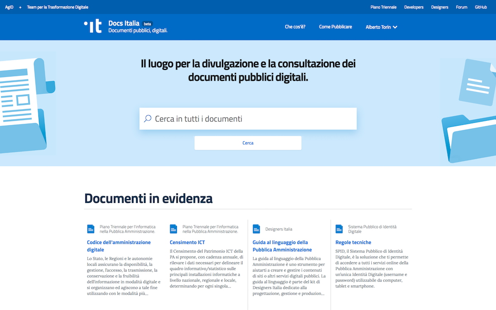
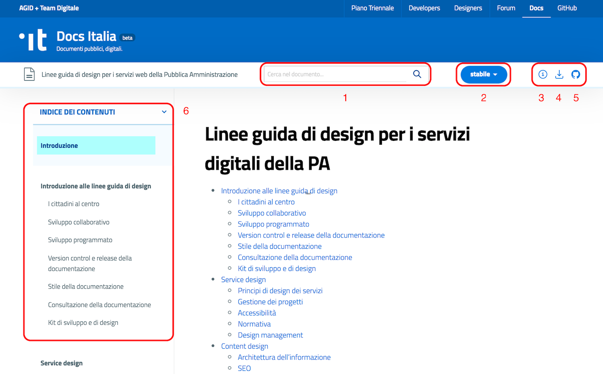
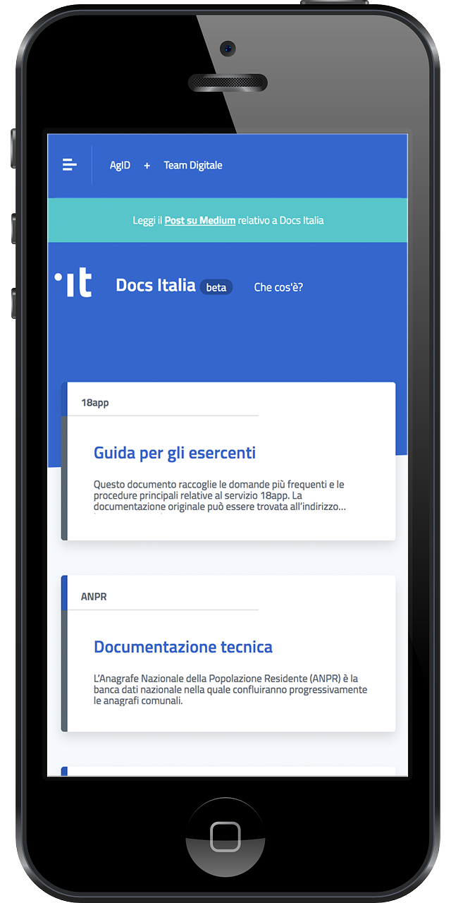
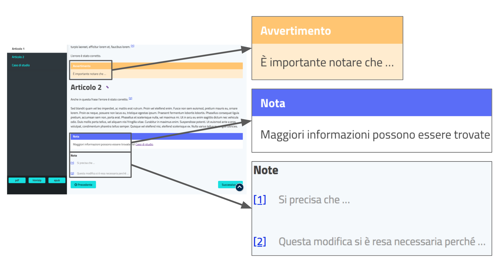

Che cos’è Docs Italia
=====================

Che cos’è
---------

Docs Italia è un servizio ideato dal `Team per la trasformazione digitale della Pubblica Amministrazione <https://teamdigitale.governo.it/>`__ in collaborazione con `AgID <http://www.agid.gov.it/>`__ ed è gestito da un team interdisciplinare di sviluppatori, designer e tech writer esperti nel documentare un progetto attraverso guide, linee guida, FAQ e documentazione tecnica e amministrativa. Insieme a `Forum Italia <http://forum.italia.it>`__ e GitHub Italia, è uno degli strumenti operativi per la trasformazione digitale dei servizi pubblici.

Al momento, Docs Italia contiene alcuni dei più importanti progetti pubblici del Paese, come ANPR (anagrafe nazionale), SPID (identità pubblica), pagoPA (sistemi di pagamento) e molti altri, visibili nella home page del sito. Altri si aggiungeranno progressivamente, sulla base delle richieste delle Pubbliche Amministrazioni che possono richiedere di utilizzare il servizio tramite `Slack di Developers Italia <https://slack.developers.italia.it/>`__ usando il canale `#docs-italia <https://developersitalia.slack.com/messages/C9T4ELD4G/>`__.

Obiettivi
---------

Docs Italia nasce con l’obiettivo di cambiare il linguaggio con cui si comunicano e si gestiscono i progetti pubblici in Italia, creando strumenti di lavoro comuni a diverse culture professionali e in cui gli aspetti normativi e tecnici possano coesistere. In questo modo, si semplifica la vita di chi lavora ai progetti (in particolare i funzionari, i tecnici e i fornitori della Pubblica Amministrazione), aumentando l’efficacia dei progetti pubblici e perseguendo una impostazione di *open government* che favorisca l’apertura, lo scambio di idee e la collaborazione.

Docs Italia permette di gestire la documentazione tecnica di un progetto (ad es. la documentazione di pagoPA), ma anche documenti amministrativi come il `Piano Triennale per l’informatica nella Pubblica Amministrazione <https://pianotriennale-ict.readthedocs.io>`__ e le linee guida (come le `Linee guida di design per i servizi web della PA <https://design-italia.readthedocs.io>`__).

La :numref:`Figura %s <hp>` mostra l’attuale home page di Docs Italia.

   L'attuale home page di Docs Italia.

Caratteristiche
---------------

Docs Italia si ispira a cinque principi, funzionali a costruire un linguaggio comune di gestione dei progetti pubblici:

1. il primo è che oggi, in tutto il mondo, i documenti non sono più il prodotto di un individuo e di un ufficio, ma sono sempre di più il frutto di una collaborazione che prevede il contributo di diverse persone e diversi profili professionali, tecnici, economici e amministrativi;

2. il secondo è che la Pubblica Amministrazione, seguendo una filosofia di `open government <https://it.wikipedia.org/wiki/Open_government>`__, tende a incoraggiare il contributo della comunità e di punti di vista esterni;

3. il terzo è che la Pubblica Amministrazione ha bisogno di modalità comuni per gestire le informazioni relative a un progetto, dalle linee guida di indirizzo alla documentazione tecnica;

4. il quarto è che i documenti non sono un oggetto statico, scolpito nella pietra o stampato nella carta, ma evolvono nel tempo: poter tenere traccia di questa evoluzione offre diversi vantaggi;

5. il quinto è che i documenti vengono fruiti sempre più spesso su Internet, e in particolare su smartphone: la semplicità di lettura fa la differenza.

.. _sec-nuove-funzionalita:

Nuove funzionalità
~~~~~~~~~~~~~~~~~~

-  Docs Italia sarà organizzato per publisher (l’ente o il Ministero che pubblica i documenti) e per progetti (ciascun progetto potrà avere diversi documenti).

-  Docs Italia avrà un motore di ricerca che permette di navigare tra i documenti. La funzione di ricerca diventa sempre più importante mano a mano che cresce la mole di testi pubblicati sulla piattaforma.

-  Un widget consentirà di pubblicare sul proprio sito web:

   -  l’elenco dei documenti appartenenti a uno specifico publisher (ad es. Ministero delle Finanze, MIUR)

   -  l’elenco dei documenti appartenenti a uno specifico progetto (ad es. ANPR)

   -  l’indice del documento

-  Attualmente è in corso di analisi lo sviluppo di una componente per `LibreOffice <https://www.libreoffice.org/>`__ che permetta l’esportazione e l’importazione di documenti in formato RST.

-  Docs Italia sarà ospitata all’URL `docs.italia.it <http://docs.italia.it>`__. Ciascun documento sarà raggiungibile all’indirizzo: `docs.italia.it/<publisher>/<progetto>/<nome-documento>`.

La `roadmap di Docs Italia <https://trello.com/b/jQUgRzRe/docs-italiasviluppo>`__ è disponibile online, espressa attraverso una board di Trello.

Architettura dell’informazione
------------------------------

.. Pagina publisher
.. ~~~~~~~~~~~~~~~~
.. 
.. 
.. Pagina progetto
.. ~~~~~~~~~~~~~~~
.. 
.. La :numref:`Figura %s <progetto>` mostra un esempio di pagina progetto. Vengono visualizzati tutti i documenti associati e una descrizione del progetto e dei suoi scopi.
.. 
.. 
.. 
..
.. 
.. 
.. .. figure:: img/progetto.png
..    :width: 6.11458in
..    :height: 5.47222in
..    :alt: Pagina progetto
..    :name: progetto
..    
..    Una pagina progetto su Docs Italia.

Pagina documento
~~~~~~~~~~~~~~~~

Ciascun documento ha le seguenti caratteristiche (vedi :numref:`Figura %s <pagina-doc>`):

1. È sempre possibile scegliere la versione del documento tramite un apposito pulsante;

2. L’utente può effettuare una ricerca specifica all’interno del documento;

3. L’indice nella barra laterale consente di passare rapidamente da una sezione all’altra;

4. È sempre possibile scaricare il documento in formato .epub e in formato .pdf;

5. Il pulsante “modifica su GitHub” permette di accedere al repository su GitHub dove è ospitato il documento e consente a chiunque di proporre delle modifiche al contenuto.

   Una pagina documento su Docs Italia.

Oltre a queste caratteristiche,

-  L’ambiente di Docs Italia è *responsive*, ovvero consente una perfetta fruizione dei documenti su tutti i dispositivi, compreso lo smartphone (vedi :numref:`Figura %s <responsive>`);

-  Le àncore in corrispondenza dei capitoli consentono di ottenere facilmente il link di un paragrafo (vedi :numref:`Figura %s <ancora>`). Per fare apparire l'àncora basta spostare il puntatore del mouse sopra al titolo corrispondente;

-  Le funzionalità dei box colorati e delle note permettono di segnalare informazioni importanti, esempi, casi di studio e interpretazioni del testo (vedi :numref:`Figura %s <box>`).

   Ambiente *responsive* della piattaforma Docs Italia.

.. figure:: img/ancora.png
   :width: 6.11458in
   :height: 1.97222in
   :alt: Ancora titolo
   :name: ancora

   Ancora in corrispondenza di un titolo.

   Box e note in una pagina del documento. 

La piattaforma
~~~~~~~~~~~~~~

-  La piattaforma di Docs Italia è basata sui progetti open source `Sphinx <http://sphinx-doc.org/>`__ e `Read the Docs <https://readthedocs.org/>`__. I documenti pubblicati sono redatti in `formato reStructuredText <http://docutils.sourceforge.net/rst.html>`__.

-  Docs Italia si presta a una ottimizzazione SEO, facilitando la ricerca dei documenti pubblici anche attraverso i motori di ricerca.

-  Docs Italia è integrato con `Forum Italia <http://forum.italia.it>`__ (a sua volta basato sul progetto open source `Discourse <https://discourse.org/>`__) per consentire di commentare i documenti.

