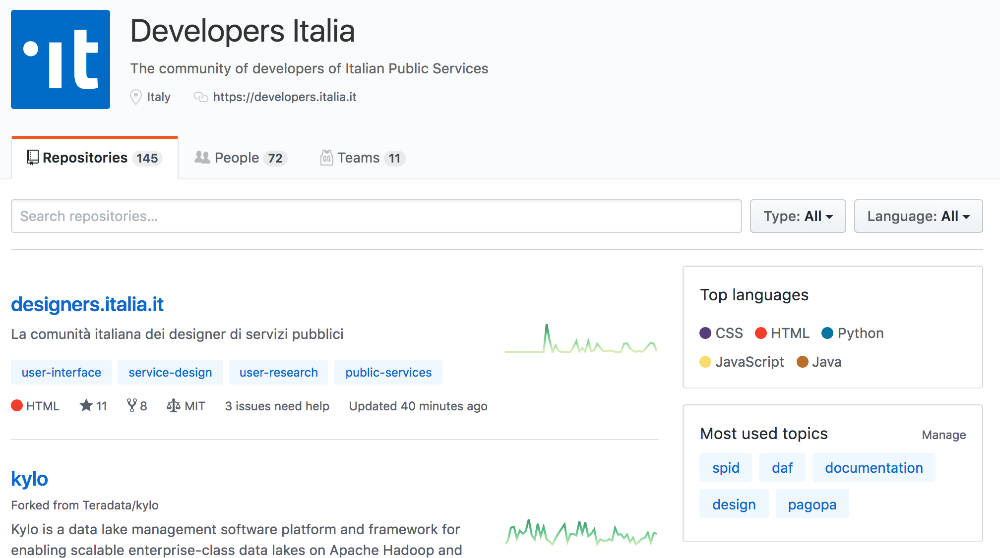
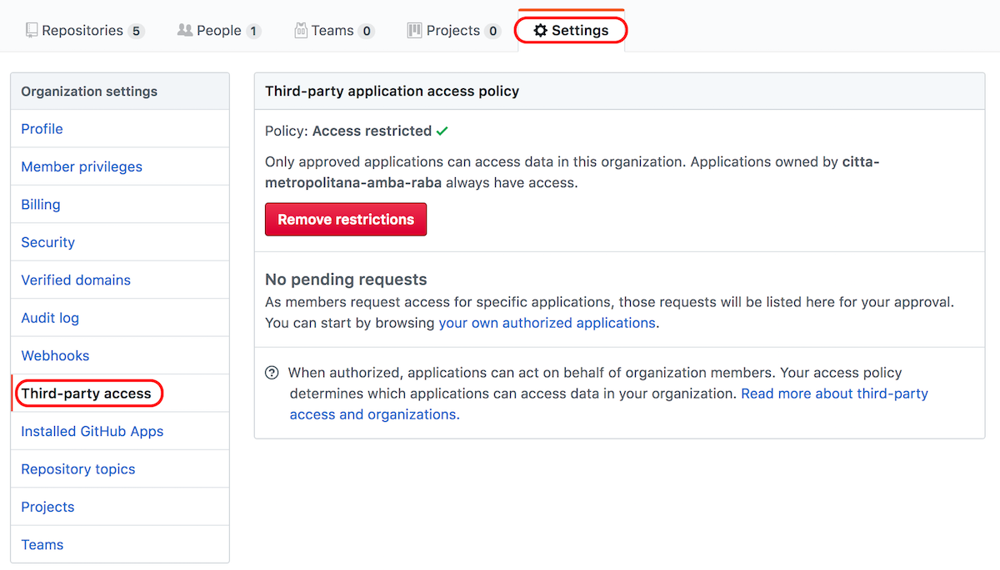

Come partecipare
================

Prerequisiti
------------

Docs Italia si basa su `GitHub <https://github.com/>`__ come strumento per pubblicare i documenti (e gestirne le versioni).

Per pubblicare un documento, è necessario avere:

1. Un **account utente su GitHub**;

2. Un’\ **organizzazione su GitHub**.

Account utente su GitHub
~~~~~~~~~~~~~~~~~~~~~~~~

Se fai parte o lavori per un Ente pubblico e vuoi pubblicare i tuoi documenti su Docs Italia, hai bisogno prima di tutto di un account su GitHub. La registrazione è gratuita e può essere completata seguendo le `istruzioni nella pagina ufficiale <https://help.github.com/articles/signing-up-for-a-new-github-account/>`__.

L’account su GitHub consente l’identificazione dell’utente e permette di effettuare tutte le operazioni in maniera sicura e tracciabile.

Organizzazione su GitHub
~~~~~~~~~~~~~~~~~~~~~~~~

L’Ente pubblico deve essere associato a un’\ `organizzazione su GitHub <https://github.com/blog/674-introducing-organizations>`__. 

`Come creare un'organizzazione su GitHub <https://github.com/organizations/new>`__

Un’organizzazione è un insieme di repository gestiti da più utenti GitHub che collaborano a progetti comuni.

L’organizzazione rappresenta una modalità efficiente di raggruppare tutti i progetti digitali di un Ente pubblico. Offre, inoltre, alcuni vantaggi nella gestione dei permessi degli utenti e opzioni di sicurezza e amministrazione avanzate. Anche l’account organizzazione è gratuito e permette un numero illimitato di repository e collaboratori.

La :numref:`Figura %s <developer>` mostra la pagina dell’organizzazione Developers Italia su GitHub. È possibile notare il numero di repository aperti, le persone che collaborano con l’organizzazione e i team.

   L'organizzazione Developers Italia su GitHub

.. note::

   Se la tua amministrazione per qualche ragione non può creare un'organizzazione su GitHub, :ref:`contatta gli amministratori di Docs Italia <sec-amministratori>` per richiedere un repository nell'organizzazione di Developers Italia. 

Conoscenza di base su Git
~~~~~~~~~~~~~~~~~~~~~~~~~

Docs Italia usa il `version control system <https://it.wikipedia.org/wiki/Controllo_versione>`__ di `Git <https://git-scm.com/>`__, che permette di gestire le diverse versioni di un documento. La pubblicazione su Docs Italia richiede una conoscenza di base di Git e di alcuni termini collegati. Consulta il :ref:`Glossario minimo <sec-glossario>` in Appendice.

.. _sec-pubblicare:

Come pubblicare un documento
----------------------------

La pubblicazione di un documento su Docs Italia avviene secondo le seguenti fasi:

1. L'amministrazione crea un'organizzazione su GitHub;

2. L'amministrazione crea un repository di configurazione nella propria organizzazione;

3. L'amministrazione richiede l'autorizzazione alla pubblicazione;

4. L'amministrazione crea un repository del documento dove caricare la propria documentazione.

I primi tre passaggi sono richiesti soltanto al primo accesso a Docs Italia: in questo caso, le principali operazioni sono a carico degli amministratori della piattaforma. 

Il caricamento e la modifica dei file contenuti nei repository di configurazione e di documento rientrano, invece, in un processo iterativo, che può essere svolto anche in maniera collaborativa.

Procedure di autorizzazione iniziali
~~~~~~~~~~~~~~~~~~~~~~~~~~~~~~~~~~~~

Le procedure di autorizzazione iniziali servono a verificare le credenziali dell’utente e a consentire la pubblicazione su Docs Italia soltanto alle amministrazioni autorizzate. 

L’Ente che vuole pubblicare su Docs Italia crea un’organizzazione su GitHub dove ospiterà i repository per la propria documentazione. 

.. note::

   **Requisiti per le organizzazioni**

   - Per poter importare i repository di un'organizzazione su Docs Italia, un utente deve rendere pubblica la propria appartenenza all’organizzazione. Per controllare l’appartenenza bisogna visitare questo indirizzo :code:`https://github.com/orgs/<nome-org>/people`, avendo cura di sostituire :code:`<nome-org>` con il nome della propria organizzazione. L’appartenenza a un'organizzazione è pubblica quando, nella scheda **People** della pagina dell'organizzazione, in corrispondenza del proprio nome compare la scritta :code:`Public` e non :code:`Private`.

   - Per permettere a un utente membro di un'organizzazione di importare i repository dei documenti, è necessario rimuovere le restrizioni sulle applicazioni di terze parti dalle impostazioni di GitHub. 
     
     Dalla pagina dell'organizzazione, vai su **Settings**, **Third-party access**, quindi clicca sul pulsante **Remove restrictions** (vedi la :numref:`Figura %s <remove-restrictions>`). Di fianco a *Policy* apparirà la dicitura **No restrictions**.

   Come rimuovere le restrizioni sulle applicazioni di terze parti per un'organizzazione su GitHub. Questo passaggio è necessario per permettere agli utenti di importare i repository dei documenti su Docs Italia.

Dopo aver compiuto queste operazioni preliminari, è possibile seguire la procedura qui sotto. 

.. topic:: Procedura
   :class: procedure
   
   1. Un amministratore dell’account organizzazione crea un apposito repository di configurazione chiamato **italia-conf**, contenente alcuni file necessari a identificare l'amministrazione, i progetti e i documenti che si desidera pubblicare su Docs Italia. :ref:`Maggiori informazioni sul repository di configurazione <sec-repo-config>` sono disponibili nel capitolo dedicato alla pubblicazione. Un esempio di repository di configurazione si trova nello :ref:`Starter kit <sec-starter-kit>` fornito.
   
   2. Un amministratore dell’account organizzazione invia una richiesta di autorizzazione alla pubblicazione su Docs Italia tramite `Slack di Developers Italia <https://slack.developers.italia.it/>`__, usando il canale `#docs-italia <https://developersitalia.slack.com/messages/C9T4ELD4G/>`__.
   
   3. Gli amministratori di Docs Italia, effettuate le opportune verifiche, autorizzano l’organizzazione alla pubblicazione.
   
   4. Un amministratore dell’account organizzazione crea un repository per il documento. Il nome del repository deve rispettare le `convenzioni sui nomi di Docs Italia <#nome-del-repository-del-documento>`__. A questo punto può aggiornare il file document_settings.yml e caricare i file del documento secondo le modalità indicate nella sezione `Repository del documento <#repository-del-documento>`__. Un esempio completo di repository del documento è contenuto nello `Starter kit <#starter-kit>`__.

.. admonition:: example
   :class: admonition-example admonition-display-page name-example

   .. role:: admonition-internal-title
      :class: admonition-internal-title

   `Processo di autorizzazione per organizzazioni GitHub`:admonition-internal-title:
   
   Il Ministero dell’Interno vuole pubblicare su Docs Italia un documento 
   chiamato “Modalità di subentro”, relativo al progetto ANPR. Il Ministero 
   dell’Interno ha un’organizzazione su GitHub, la cui amministratrice è 
   Giulia Rossi.
   
   - Giulia Rossi crea un repository di configurazione 
     presso l’organizzazione GitHub del Ministero dell’Interno.
   
   - Giulia Rossi invia la richiesta di autorizzazione 
     alla pubblicazione su Docs Italia, e la sua richiesta viene approvata.
   
   - Giulia Rossi crea, infine, un repository del documento 
     presso l’organizzazione GitHub del Ministero dell’Interno, 
     dove inserirà tutti i file relativi alla documentazione, aggiornando allo 
     stesso tempo il file document_settings.yml.

Nome del repository del documento
~~~~~~~~~~~~~~~~~~~~~~~~~~~~~~~~~

Il nome del :ref:`repository del documento <sec-repo-doc>` deve seguire il formato: **nomeprogetto-nomedocumento-docs**.

Per esempio, un documento dal titolo “Istruzioni per il cambio di residenza” all’interno del progetto ANPR potrebbe essere ospitato nel repository **anpr-cambioresidenza-docs**.

Il nome deve sempre finire con **-docs** per segnalare che il repository contiene della documentazione.

Passi successivi
~~~~~~~~~~~~~~~~

Dopo aver creato i repository, è possibile caricare i file per generare la documentazione. Le procedure sono descritte nel capitolo :ref:`Pubblicare un documento <pubblicare-un-documento>`.

.. _sec-amministratori:

Amministratori di Docs Italia e assistenza
------------------------------------------

Docs Italia ha dei maintainer con dei privilegi di amministrazione che permettono loro qualsiasi intervento all’interno della piattaforma. Un maintainer di Docs Italia può, per esempio, gestire gli utenti e rimuovere dei documenti già pubblicati.

Tuttavia, nel caso in cui siano chiamati a supportare la creazione di un documento ospitato in un repository di un’organizzazione GitHub, i maintainer devono farsi autorizzare dagli amministratori del repository specifico.

Le attività di pubblicazione utilizzando GitHub e Docs Italia sono a carico dell’organizzazione e dell’utente. In caso di problemi, è possibile chiedere supporto al **servizio assistenza di Docs Italia** tramite `Slack di Developers Italia <https://slack.developers.italia.it/>`__ usando il canale `#docs-italia <https://developersitalia.slack.com/messages/C9T4ELD4G/>`__.

