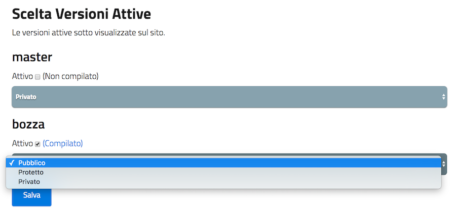

.. _pubblicare-un-documento:

Pubblicare un documento
=======================

Dopo aver scritto la documentazione in formato RST, è possibile avviare la fase di pubblicazione.

In questo capitolo vengono forniti alcuni chiarimenti sul repository di configurazione, sul repository del documento e sul backend di Docs Italia.

.. _sec-repo-config:

Repository di configurazione
----------------------------

Il repository di configurazione deve essere chiamato **italia-conf** e contenere le informazioni (metadati) relative al publisher, ai progetti e ai documenti correlati che appaiono in vari punti all’interno delle pagine su Docs Italia.

Puoi modificare i file nel repository di configurazione presente nello Starter kit come descritto qui sotto. Successivamente, dovrai **caricare i file sul repository remoto** creato in precedenza (vedi :ref:`Come pubblicare un documento <sec-pubblicare>`) usando :ref:`una delle due procedure descritte in Appendice <sec-procedure-caricamento>`.

.. admonition:: example
   :class: admonition-example display-page name-example

   .. role:: admonition-internal-title
      :class: admonition-internal-title

   `Repository di configurazione di prova`:admonition-internal-title:
   
   Lo :ref:`Starter kit <sec-starter-kit>` contiene un esempio di repository di configurazione. Consulta le istruzioni contenute nel kit per conoscere come modificare i file.

Contenuto del repository
~~~~~~~~~~~~~~~~~~~~~~~~

Il repository di configurazione deve contenere due file principali:

1. **publisher_settings.yml**, per i metadati relativi al publisher;

2. **projects_settings.yml**, per i metadati relativi ai progetti.

In questi file vengono specificati, per esempio, quali progetti appartengono al publisher e quali repository del documento appartengono a un determinato progetto. In aggiunta, nel repository di configurazione possono essere inclusi i loghi del publisher o dei progetti.

Oltre ai metadati liberamente modificabili, esiste un **set di tag tratti da un vocabolario controllato**, condiviso fra Docs Italia e Forum Italia. Tramite questi tag (almeno 5 per ciascun publisher o progetto) si stabilisce un collegamento fra i contenuti di Docs Italia e gli argomenti nel Forum, permettendo agli utenti di trovare più rapidamente quello che cercano.

Le Tabelle 2 e 3 illustrano alcuni dei possibili metadati che è possibile specificare nei file di configurazione. Gli esempi associati mostrano come formattare i file di configurazione. Per maggiori informazioni è possibile consultare le istruzioni allegate allo :ref:`Starter kit <sec-starter-kit>`.

Metadati del publisher
~~~~~~~~~~~~~~~~~~~~~~

.. important::

   I campi **name** e **description** sono obbligatori.

.. _meta-pub:

.. table:: Alcuni dei metadati associati al publisher.

   +-------------------------+------------------------------------------------------------------------------------------+
   | **Parametro**           | **Descrizione**                                                                          |
   +=========================+==========================================================================================+
   | name                    | Il nome per esteso dell’Ente associato al publisher                                      |
   +-------------------------+------------------------------------------------------------------------------------------+
   | description             | Una descrizione estesa delle funzioni e degli scopi dell’Ente                            |
   +-------------------------+------------------------------------------------------------------------------------------+
   | short_name              | Il nome abbreviato dell’Ente associato al publisher o l’acronimo (opzionale)             |
   +-------------------------+------------------------------------------------------------------------------------------+
   | motto                   | Il motto o una breve frase che contraddistingue l’Ente (opzionale)                       |
   +-------------------------+------------------------------------------------------------------------------------------+
   | logo                    | L’URL del logo (può essere contenuto nel repository di configurazione) (opzionale)       |
   +-------------------------+------------------------------------------------------------------------------------------+
   | website                 | L’URL del sito dell’Ente (opzionale)                                                     |
   +-------------------------+------------------------------------------------------------------------------------------+
   | address                 | L’indirizzo della sede dell’Ente (opzionale)                                             |
   +-------------------------+------------------------------------------------------------------------------------------+
   | tags                    | La lista dei tag che descrivono il publisher (opzionale)                                 |
   +-------------------------+------------------------------------------------------------------------------------------+

.. admonition:: example
   :class: admonition-example display-page name-example

   .. role:: admonition-internal-title
      :class: admonition-internal-title

   `File publisher_settings.yml tratto dallo Starter kit`:admonition-internal-title:
   
   .. code-block:: yml
      :linenos:
      
      publisher:                                                      
        name: Ministero della Documentazione Pubblica                
        description:                                                 
          Lorem ipsum dolor sit amet, consectetur                   
          adipisicing elit, sed do eiusmod tempor                   
          incididunt ut labore et dolore magna aliqua.              
          Ut enim ad minim veniam, quis nostrud                       
          exercitation ullamco laboris nisi ut                        
          aliquip ex ea commodo consequat.                            
          Duis aute irure dolor in reprehenderit in                   
          voluptate velit esse cillum dolore eu                       
          fugiat nulla pariatur. Excepteur sint                       
          occaecat cupidatat non proident, sunt in                    
          culpa qui officia deserunt mollit anim id                   
          est laborum.                                                
        short_name: Min. Doc. Pub.                                    
        website: https://www.ministerodocumentazione.gov.it           
        tags:                                                         
          - documents                                                 
          - public                                                    
          - amazing publisher                                         
        logo: assets/images/logo.svg

Metadati dei progetti
~~~~~~~~~~~~~~~~~~~~~

.. important::

   I campi **name**, **description** e **documents** sono obbligatori.

.. _meta-prog:

.. table:: Alcuni dei metadati associati a ciascun progetto.

   +---------------+------------------------------------------------------------------------------------------------------------------+
   | **Parametro** | **Descrizione**                                                                                                  |
   +===============+==================================================================================================================+
   | name          | Il nome per esteso del progetto                                                                                  |
   +---------------+------------------------------------------------------------------------------------------------------------------+
   | description   | Una descrizione estesa delle funzioni e degli scopi del progetto                                                 |
   +---------------+------------------------------------------------------------------------------------------------------------------+
   | documents     | La lista dei documenti afferenti al progetto, identificati tramite i nomi dei loro repository                    |
   +---------------+------------------------------------------------------------------------------------------------------------------+
   | short_name    | Il nome abbreviato del progetto o l’acronimo (opzionale)                                                         |
   +---------------+------------------------------------------------------------------------------------------------------------------+
   | logo          | L’URL del logo (può essere contenuto nel repository di configurazione) (opzionale)                               |
   +---------------+------------------------------------------------------------------------------------------------------------------+
   | website       | L’URL del sito del progetto (opzionale)                                                                          |
   +---------------+------------------------------------------------------------------------------------------------------------------+
   | start_date    | La data di inizio del progetto (opzionale)                                                                       |
   +---------------+------------------------------------------------------------------------------------------------------------------+
   | end_date      | La data di fine del progetto (opzionale)                                                                         |
   +---------------+------------------------------------------------------------------------------------------------------------------+
   | tags          | La lista dei tag che descrivono il progetto (opzionale)                                                          |
   +---------------+------------------------------------------------------------------------------------------------------------------+

.. admonition:: example
   :class: admonition-example display-page name-example

   .. role:: admonition-internal-title
      :class: admonition-internal-title

   `File projects_settings.yml tratto dallo Starter kit`:admonition-internal-title:
   
   .. code-block:: yml
      :linenos:
      
      projects:                                                    
        - name: Progetto Documentato Pubblicamente                 
          description:                                             
            Lorem ipsum dolor sit amet, consectetur                
            adipisicing elit, sed do eiusmod tempor                
            incididunt ut labore et dolore magna aliqua.           
            Ut enim ad minim veniam, quis nostrud                  
            exercitation ullamco laboris nisi ut                   
            aliquip ex ea commodo consequat.                       
            Duis aute irure dolor in reprehenderit in              
            voluptate velit esse cillum dolore eu                  
            fugiat nulla pariatur. Excepteur sint                  
            occaecat cupidatat non proident, sunt in               
            culpa qui officia deserunt mollit anim id              
            est laborum.                                           
          documents:                                               
            - project-document-doc                                 
            - another-project-document-doc                         
          short_name: PDP                                          
          website: https://progetto.ministerodocumentazione.gov.it 
          tags:                                                    
            - digital                                              
            - citizenship                                          
            - amazing project                                      

Repository del documento
------------------------

Dopo aver inserito il repository del documento fra quelli presenti nel file ``projects_settings.yml``, è possibile importare il documento dal backend di Docs Italia. Per una corretta compilazione, il repository del documento deve contenere come minimo alcuni file specifici.

.. admonition:: example
   :class: admonition-example display-page name-example

   .. role:: admonition-internal-title
      :class: admonition-internal-title

   `Repository del documento di prova`:admonition-internal-title:
   
   Lo :ref:`Starter kit <sec-starter-kit>` contiene un esempio di repository del documento. Consulta le istruzioni contenute nel kit per conoscere come modificare i file.
   

Prima di pubblicare il documento su Docs Italia, l’utente deve:

1. Modificare il file README.md, descrivendo il contenuto del repository;

2. Modificare il file index.rst e inserire i file della documentazione;

3. Modificare il file LICENSE;

4. Modificare il file document_settings.yml.

Consulta le sezioni seguenti per maggiori informazioni su come modificare questi file.

.. _sec-struttura:

Struttura del repository
~~~~~~~~~~~~~~~~~~~~~~~~

Lo :ref:`Starter kit <sec-starter-kit>` suggerisce l’uso di una struttura del repository del documento di questo tipo:

.. admonition:: example
   :class: admonition-example display-page name-example

   .. role:: admonition-internal-title
      :class: admonition-internal-title

   `Struttura del repository`:admonition-internal-title:
   
   .. code-block:: yml
      :linenos:
      
      +-- README.md
      +-- index.rst                        
      +-- titolo-capitolo-1.rst                       
      +-- titolo-capitolo-2.rst                                  
      +-- LICENSE                          
      +-- AUTHORS                          
      +-- document_settings.yml            

Il repository dovrà comprendere, come requisito minimo:

1. Un file **README.md**, che serve da homepage del repository su GitHub e in cui viene descritto il contenuto del repository stesso.

2. Un file **index.rst**, che corrisponderà alla pagina principale del sito della documentazione.

3. I file **titolo-capitolo-1.rst** e **titolo-capitolo-2.rst**, come esempio di capitoli del documento.

4. I file **LICENSE** e **AUTHORS**, che specificano la licenza d’uso associata al repository e l’attribuzione dei diritti d’autore.

5. Un file **document_settings.yml**, che specifica i metadati associati al documento.

File README.md
~~~~~~~~~~~~~~

Il file README.md rappresenta la prima pagina che gli utenti vedono quando accedono a un repository su GitHub. Deve fornire le informazioni sul contenuto del repository stesso e viene redatto usando la `sintassi Markdown <https://guides.github.com/features/mastering-markdown/>`__, che differisce dal formato RST discusso in precedenza. Puoi consultare l’esempio contenuto nello :ref:`Starter kit <sec-starter-kit>`.

Il file README.md comincia con un titolo con il seguente formato:

:code:`# Nome_Progetto, Nome_Documento`

Il segno # indica un titolo e Nome_Documento (obbligatorio) serve a distinguere diversi documenti relativi, per esempio, ad aspetti diversi di uno stesso progetto.

All’inizio del README, indica il **link alla documentazione** su Docs Italia, assieme al/ai **link ai testi di partenza**, se presenti.

File index.rst
~~~~~~~~~~~~~~

Il file index.rst corrisponde alla **home page del documento** e serve ad almeno tre scopi:

1. Visualizzare il titolo del documento;

2. Fornire un’introduzione al testo;

3. Visualizzare un indice di tutte le pagine contenute.

Puoi trovare `maggiori informazioni sulla struttura dell'indice del documento <appendice-2/indice.html>`_ in Appendice. 

Struttura del documento
~~~~~~~~~~~~~~~~~~~~~~~

I vari capitoli del documento sono contenuti in file separati allo stesso livello del file ``index.rst``. 
Per documenti più complessi, con sezioni su più livelli, la `struttura consigliata <appendice-2/struttura.html>`_ è descritta in Appendice. 

File LICENSE e AUTHORS
~~~~~~~~~~~~~~~~~~~~~~

Il file LICENSE specifica il tipo di licenza associata alla documentazione. Le licenze sono identificate attraverso il loro `codice SPDX <https://spdx.org/licenses/>`__.

Per i documenti contenuti in Docs Italia, è obbligatorio indicare una licenza aperta. Il suggerimento è di usare una delle seguenti opzioni:

-  CC-BY-4.0 per la documentazione;

-  CC0-1.0 per le leggi, gli schemi e i documenti normativi.

Nel caso di licenza CC-BY-4.0 è obbligatorio creare un file AUTHORS che contiene l’attribuzione della proprietà dei diritti d’autore. Nel caso di licenza CC0-1.0 è possibile farlo (*MAY*) ma non è obbligatorio.

Per maggiori informazioni, è possibile consultare il `README per le licenze <https://teamdigitale.github.io/licenses/README.it.html>`__ del Team per la Trasformazione Digitale.

File document_settings.yml
~~~~~~~~~~~~~~~~~~~~~~~~~~

Il file document_settings.yml specifica i **metadati associati al documento**, in modo simile a quanto fatto in precedenza per `publisher <#metadati-del-publisher>`__ e `progetto <#metadati-dei-progetti>`__. Il documento eredita i metadati relativi al publisher e al progetto da quelli presenti nei file del `repository di configurazione <#repository-di-configurazione>`__, se presenti.

I metadati facilitano la ricerca delle informazioni da parte degli utenti. In particolare, anche per i documenti è previsto l’uso di **tag tratti da un vocabolario controllato** per permettere l’integrazione fra Docs Italia e il Forum (vedi anche `Repository di configurazione <#repository-di-configurazione>`__).

La :numref:`Tabella %s <meta-doc>` mostra un elenco dei possibili metadati e una loro descrizione. L’esempio successivo mostra il file *document_settings.yml* contenuto nello :ref:`Starter kit <sec-starter-kit>`.

.. important::

   I campi **name**, **description** e **tags** sono obbligatori per la corretta compilazione del documento. 

.. _meta-doc:

.. table:: Alcuni dei metadati associati a ciascun documento. I campi contrassegnati con l'asterisco sono obbligatori.

   +------------------+----------------------------------------------------------------------------------------------------------------+
   | **Parametro**    | **Descrizione**                                                                                                |
   +==================+================================================================================================================+
   | name (\*)        | Il nome per esteso del documento                                                                               |
   +------------------+----------------------------------------------------------------------------------------------------------------+
   | description (\*) | Una descrizione estesa delle funzioni e degli scopi del documento                                              |
   +------------------+----------------------------------------------------------------------------------------------------------------+
   | tags (\*)        | La lista dei tag che descrivono il documento                                                                   |
   +------------------+----------------------------------------------------------------------------------------------------------------+
   | short_name       | Il nome abbreviato del documento (opzionale)                                                                   |
   +------------------+----------------------------------------------------------------------------------------------------------------+
   | author           | Chi ha creato il documento, username GitHub (opzionale)                                                        |
   +------------------+----------------------------------------------------------------------------------------------------------------+
   | contributors     | Chi ha collaborato alla stesura del testo: nomi e cognomi (opzionale)                                          |
   +------------------+----------------------------------------------------------------------------------------------------------------+
   | published        | La data in cui il documento è stato pubblicato per la prima volta (opzionale)                                  |
   +------------------+----------------------------------------------------------------------------------------------------------------+
   | expiration       | La data in cui il documento diventa obsoleto, utilizzabile per nascondere documenti non più validi (opzionale) |
   +------------------+----------------------------------------------------------------------------------------------------------------+
   | id               | Un identificativo univoco della documentazione (opzionale)                                                     |
   +------------------+----------------------------------------------------------------------------------------------------------------+
   | license          | Il tipo di licenza associato al documento (opzionale)                                                          |
   +------------------+----------------------------------------------------------------------------------------------------------------+
   | origin           | L’URL del documento di partenza (opzionale)                                                                    |
   +------------------+----------------------------------------------------------------------------------------------------------------+
   | software_website | L’URL del software a cui la documentazione si riferisce (opzionale)                                            |
   +------------------+----------------------------------------------------------------------------------------------------------------+
   | audience         | A chi è rivolto il documento (ad es. cittadini, comuni, software house, ecc) (opzionale)                       |
   +------------------+----------------------------------------------------------------------------------------------------------------+
   | type             | Il tipo di documento (ad es. linee guida, documentazione tecnica, leggi, procedure, ecc) (opzionale)           |
   +------------------+----------------------------------------------------------------------------------------------------------------+

.. admonition:: example
   :class: admonition-example display-page name-example

   .. role:: admonition-internal-title
      :class: admonition-internal-title

   `File document_settings.yml tratto dallo Starter kit`:admonition-internal-title:
   
   .. code-block:: yml
      :linenos:
      
      document:
        name: Titolo del documento
        description: |
          Lorem ipsum dolor sit amet, consectetur
          adipisicing elit, sed do eiusmod tempor
          incididunt ut labore et dolore magna aliqua.
          Ut enim ad minim veniam, quis nostrud
          exercitation ullamco laboris nisi ut
          aliquip ex ea commodo consequat.
          Duis aute irure dolor in reprehenderit in
          voluptate velit esse cillum dolore eu
          fugiat nulla pariatur. Excepteur sint
          occaecat cupidatat non proident, sunt in
          culpa qui officia deserunt mollit anim id
          est laborum.
        tags:
          - topic
          - related topic
          - amazing project

Funzione commenti con Forum Italia
----------------------------------

Per attivare la funzione commenti, inserisci questo script (e gli id necessari, che ti verranno forniti dagli amministratori di Docs Italia) in ciascuna delle sezioni che vuoi rendere commentabili. I commenti saranno visibili anche su Forum Italia.

Docs Italia è completamente integrato con `Forum Italia <https://forum.italia.it/>`__, la piattaforma di discussione sui progetti digitali della Pubblica Amministrazione.

Tramite le funzionalità di `Discourse <https://discourse.org/>`__, è possibile aggiungere dei commenti ai propri documenti. Ciascun commento inserito su Docs Italia è automaticamente visibile anche su uno specifico topic in Forum Italia. Viceversa, quando vengono inseriti dei commenti nel topic sul Forum, questi sono subito visibili anche nel documento su Docs Italia.

Aggiungere i commenti nel documento
~~~~~~~~~~~~~~~~~~~~~~~~~~~~~~~~~~~

Al momento, è possibile aggiungere un thread di commenti per ciascuna pagina. Questo corrisponde a un singolo topic nel Forum.

Quando richiedi l’autorizzazione a pubblicare un documento su Docs Italia, gli amministratori creeranno per te una Categoria nel Forum dove verranno visualizzati i commenti al tuo documento.

Per ciascun argomento nel Forum, ti verrà assegnato un :code:`<topic-id>` dagli amministratori. Per creare i commenti in una pagina, copia lo script seguente alla fine del file RST corrispondente:

.. code-block:: rst

   .. discourse::
   
   :topic_identifier: <topic-id>

sostituendo :code:`<topic-id>` con il codice opportuno.

.. admonition:: example
   :class: admonition-example display-page name-example

   .. role:: admonition-internal-title
      :class: admonition-internal-title

   `Il codice da inserire per il topic con ID 1234 è:`:admonition-internal-title:
   
   .. code-block:: rst
      :linenos:
      
      .. discourse::
      
      :topic_identifier: 1234
      
   
Ripetendo questa procedura, è possibile collegare ciascuna pagina del documento con il corrispondente argomento sul Forum. In caso di problemi, è possibile :ref:`contattare gli amministratori di Docs Italia <sec-amministratori>`.

Caricare i file sul repository remoto
-------------------------------------

Tutti i file necessari alla creazione del documento su Docs Italia devono essere caricati nel repository del documento remoto, in modo che Docs Italia possa aggiornare la pagina del documento, attualmente vuota. Ogni documento su Docs Italia viene aggiornato automaticamente ogni qual volta viene effettuata una modifica al repository di configurazione o del documento.

Le :ref:`procedure da utilizzare <sec-procedure-caricamento>` per caricare i file sono descritte in Appendice.

.. _sec-backend:

Backend di Docs Italia
----------------------

Docs Italia possiede una modalità di backend, ovvero una piattaforma accessibile dagli utenti autorizzati dove è possibile eseguire alcune attività di amministrazione avanzata (vedi :numref:`Figura %s <backend>`).

L’utente può accedere al backend di Docs Italia semplicemente con il proprio account GitHub. 

.. figure:: img/backend.png
   :alt: Backend di Docs Italia
   :name: backend

   Il backend di Docs Italia per gestire un documento. 

.. note::

   Al primo accesso, l’utente deve autorizzare a sua volta la piattaforma a interagire con la propria organizzazione GitHub: tale operazione è necessaria per consentire l’aggiornamento del documento a ogni modifica del repository.

Il backend permette di modificare le impostazioni avanzate, come l’attivazione o meno di determinate versioni di un documento o l’aggiornamento manuale delle pagine. Da qui, l’utente può gestire tutti i documenti corrispondenti ai repository di una determinata organizzazione per i quali ha i permessi di scrittura.

Dal backend sarà possibile accedere ad alcuni widget relativi al publisher, ai progetti o ai documenti. Per esempio, la lista dei progetti, la lista dei documenti e l’indice di un documento.

Anteprima del documento
~~~~~~~~~~~~~~~~~~~~~~~

Docs Italia prevede la possibilità di creare un’anteprima dei documenti privata, non raggiungibile tramite i collegamenti all’interno della piattaforma, in modo da poterla controllare prima di renderla pubblica.

I documenti privati sono raggiungibili dal publisher cliccando sul pulsante **Mostra Documenti** nel backend della piattaforma. Tali documenti possono essere resi pubblici in un secondo tempo tramite un’apposita impostazione nel backend di Docs Italia.

La :numref:`Figura %s <privato>` mostra com’è possibile impostare un documento privato su Docs Italia.

   Il backend di Docs Italia permette di impostare documenti privati.

Documenti in lingue multiple
~~~~~~~~~~~~~~~~~~~~~~~~~~~~

Docs Italia permetterà di gestire i documenti e le loro traduzioni. L’utente potrà leggere il documento in un’altra lingua in qualsiasi pagina si trovi, semplicemente selezionando il pulsante corrispondente. Questa funzionalità verrà presto aggiunta alla piattaforma. 

.. Per creare un documento multilingue è necessario creare i documenti nelle diverse lingue seguendo le procedure descritte in precedenza e, successivamente, impostare un documento come “principale” e indicare gli altri come traduzioni di questo.
.. 
.. Per esempio, un documento in italiano chiamato *anpr-modalitasubentro* potrebbe essere il documento principale. Per indicarne il documento *anpr-modalitasubentro-eng* come la traduzione inglese, segui la seguente procedura.
.. 
.. .. topic:: Procedura
..    :class: procedure
..    
..    :procedure-internal-title:`Impostare la traduzione di un documento`
.. 
..    1. Accedi al backend di Docs Italia corrispondente al documento principale, *anpr-modalitasubentro*.
..    
..    2. Dal pannello di amministrazione, seleziona la voce **Translations**.
..    
..    3. Nel riquadro **Project**, indica il nome del documento corrispondente alla traduzione. In questo caso, *anpr-modalitasubentro-eng*.
..   
..    4. Clicca sul pulsante **Submit**.
.. 
.. La :numref:`Figura %s <traduzione>` mostra il backend di Docs Italia relativo alla selezione dei documenti di traduzione.
.. 
.. Per problemi con la creazione di documenti multilingue è possibile contattare gli amministratori di Docs Italia tramite `Slack di Developers Italia <https://slack.developers.italia.it/>`__ usando il canale `#docs-italia <https://developersitalia.slack.com/messages/C9T4ELD4G/>`__.
.. 
.. .. figure:: img/traduzione.jpg
..    :width: 5.70313in
..    :height: 3.65311in
..    :alt: Documenti multilingue
..    :name: traduzione
.. 
..    Il backend di Docs Italia permette di impostare documenti multilingue.
